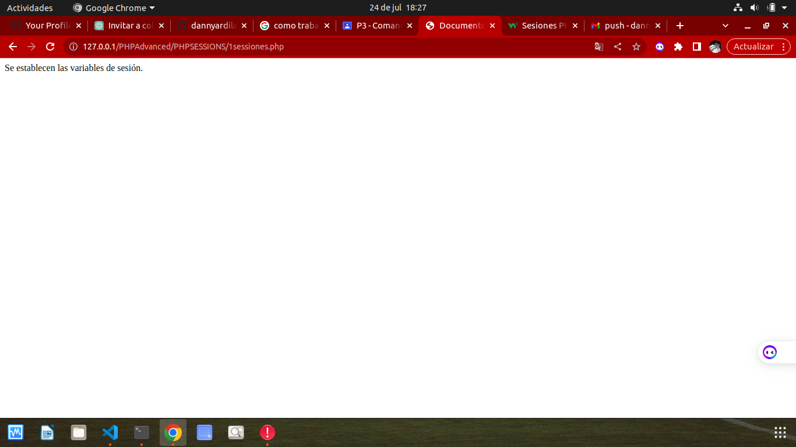
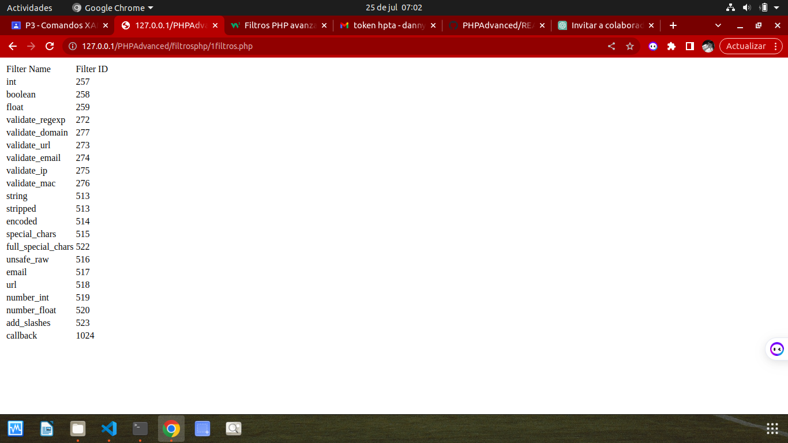
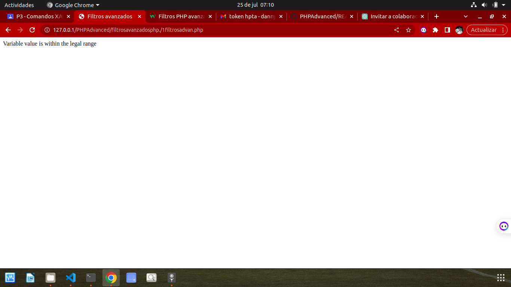
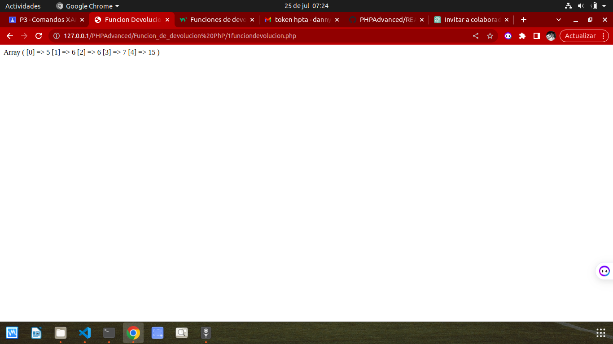
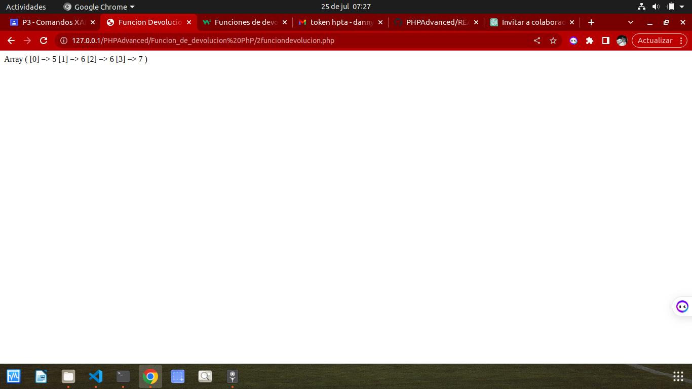
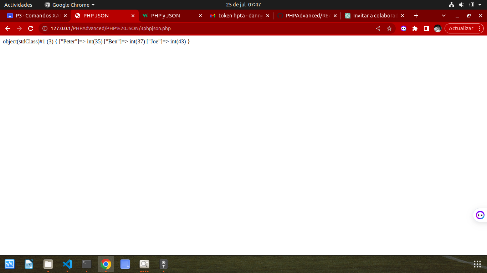

### PHPAdvanced

## Ejercicios sessiones php

# Ejercicio 1: Sessiones

# Ejercicio 2: Sessiones

# Ejercicio 3: Sessiones

# Ejercicio 4: Sessiones

---

## Ejercicios Filtros php

# Ejercicio 1: Filtros

# Ejercicio 2: Filtros

# Ejercicio 3: Filtros

# Ejercicio 4: Filtros

# Ejercicio 5: Filtros

# Ejercicio 6: Filtros

# Ejercicio 7: Filtros

---

## Ejercicios Filtros Avanzados en php

# Ejercicio 1: Filtros Avanzados

# Ejercicio 2: Filtros Avanzados

# Ejercicio 3: Filtros Avanzados

# Ejercicio 4: Filtros Avanzados

---

## Ejercicios Funciones de devolución de llamada

# Ejercicio 1: Funciones de devolución de llamada

# Ejercicio 2: Funciones de devolución de llamada

# Ejercicio 3: Funciones de devolución de llamada

---

## Ejercicios PHP JSON

# Ejercicio 1:PHP JSON

# Ejercicio 2:PHP JSON

# Ejercicio 3: PHP JSON

# Ejercicio 4:PHP JSON

# Ejercicio 5:PHP JSON

# Ejercicio 6: PHP JSON

# Ejercicio 7:PHP JSON

# Ejercicio 8: PHP JSON

