# PHPAdvanced

## PHP DATE AND TIME 

## Ejercicio.1

### El parámetro de formato requerido de la función date() especifica cómo formatear la fecha (o la hora).
### Aquí hay algunos caracteres que se usan comúnmente para las fechas:

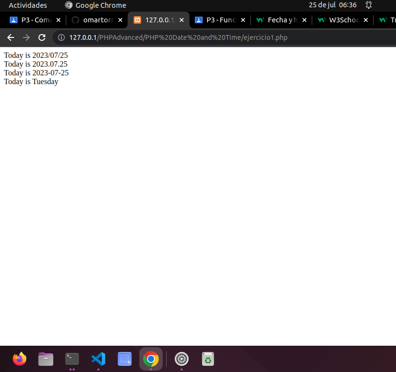

## Ejercicio.2
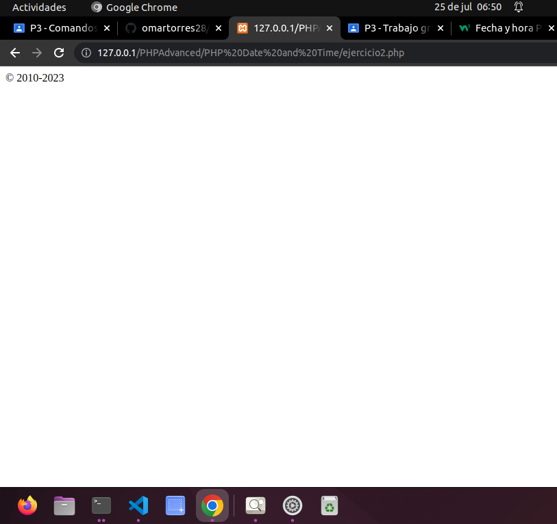

## Ejercicio.3 
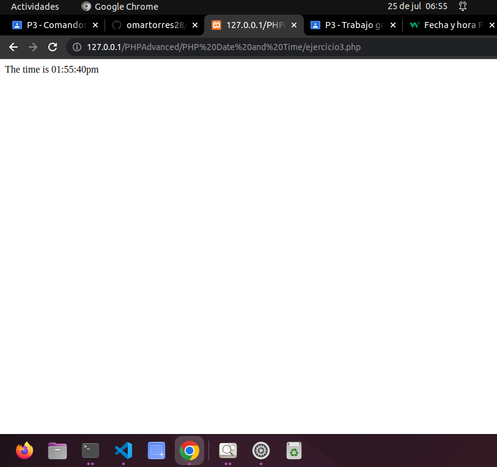

## Ejercicio.4 

## Ejercicio.5 
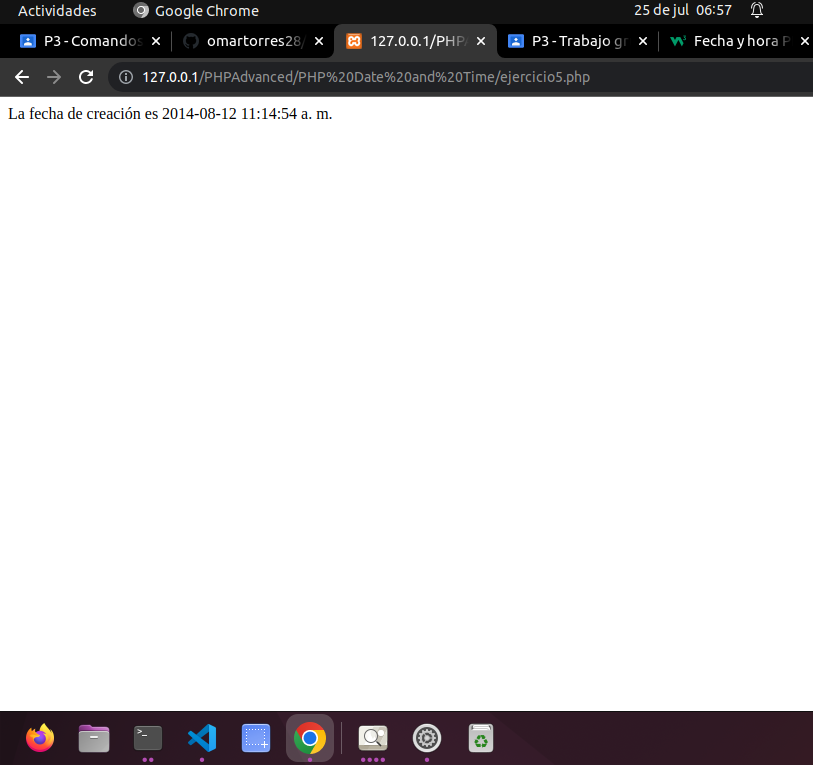

## Ejercicio.6 
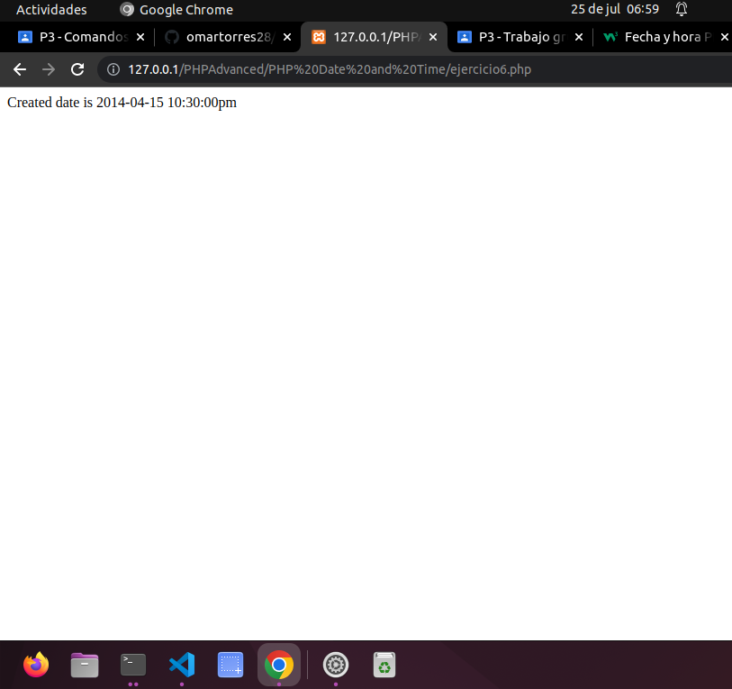

## Ejercicio.7
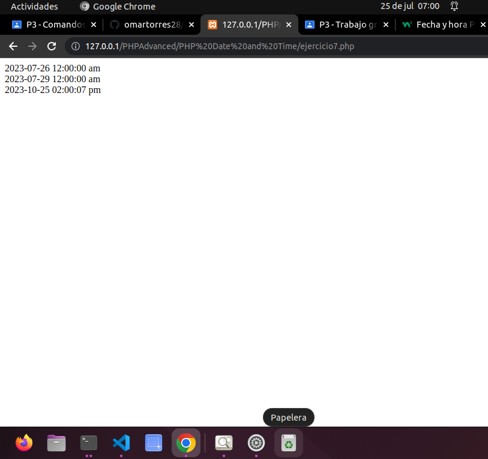

## Ejercicio.8 
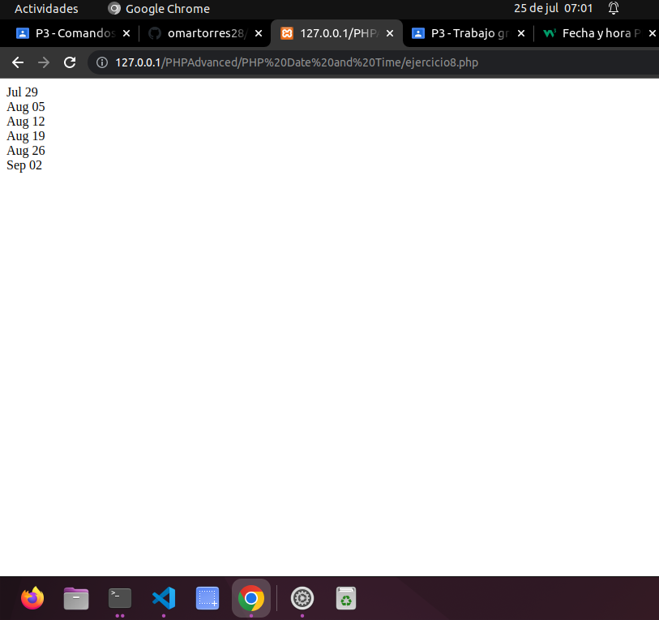

## Ejercicio.9 

# PHP INCLUDE 

## Ejercicio.1
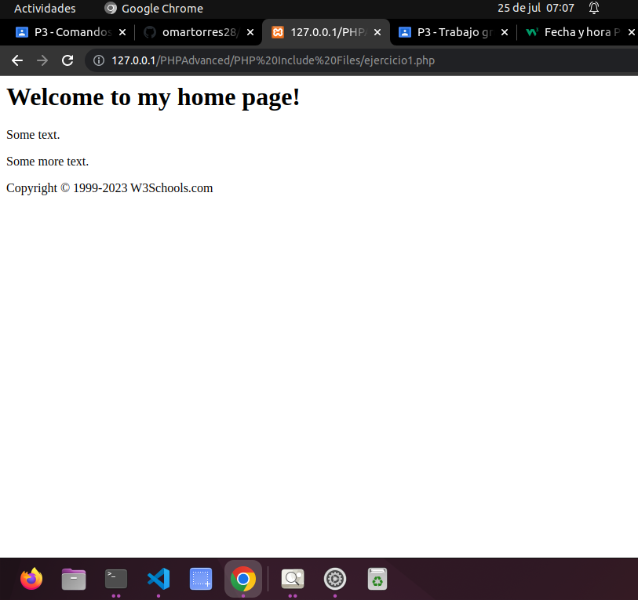

## Ejercicio.2 
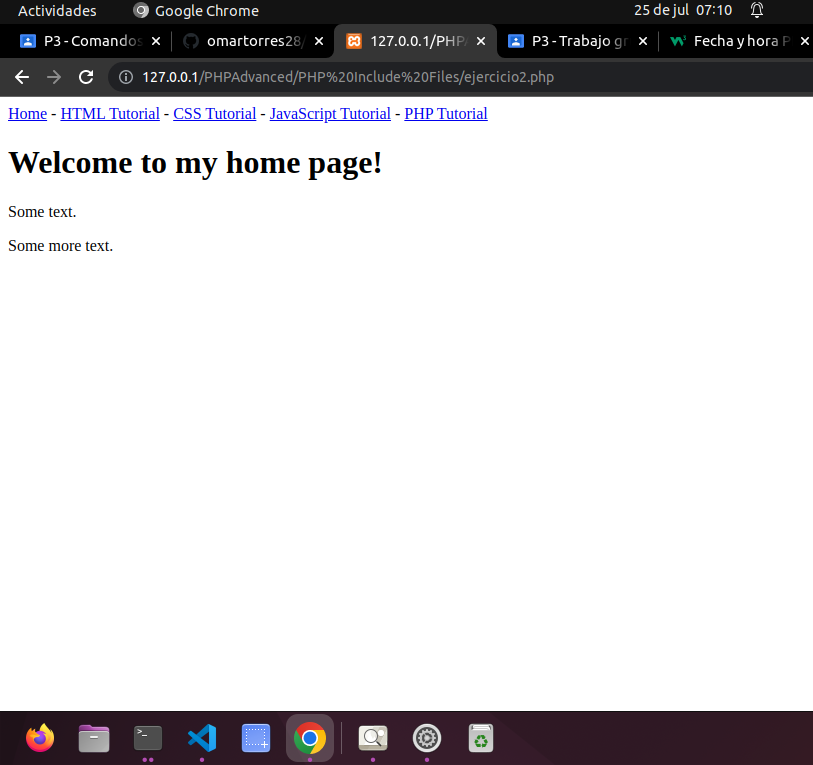

## Ejercicio.3 
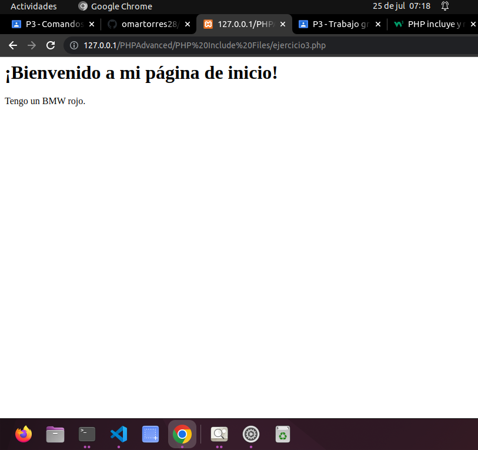

## Ejercicio.4
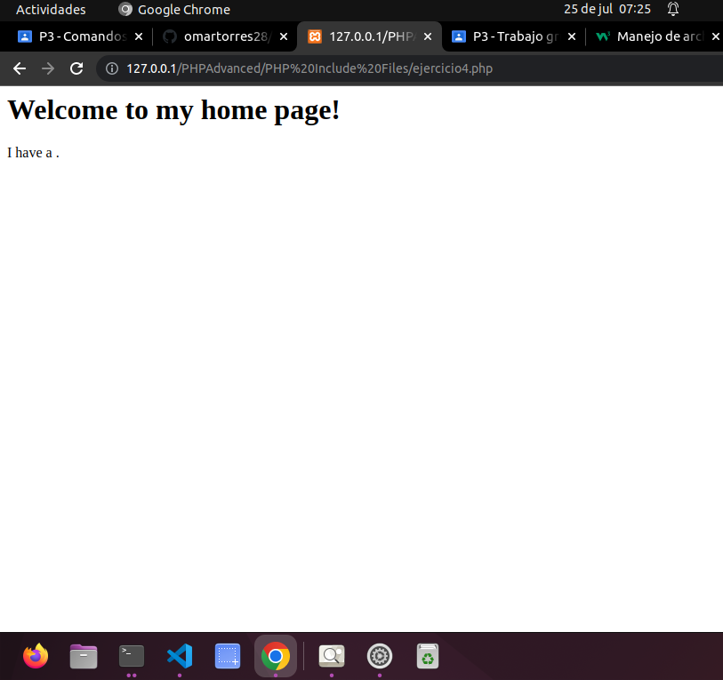

## Ejercicio.5
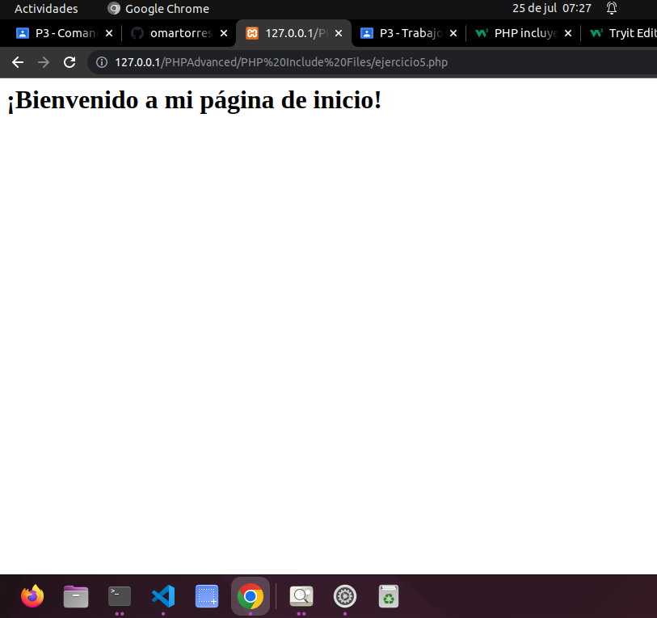

# PHP FILE HANDLING

## Ejercicio.1
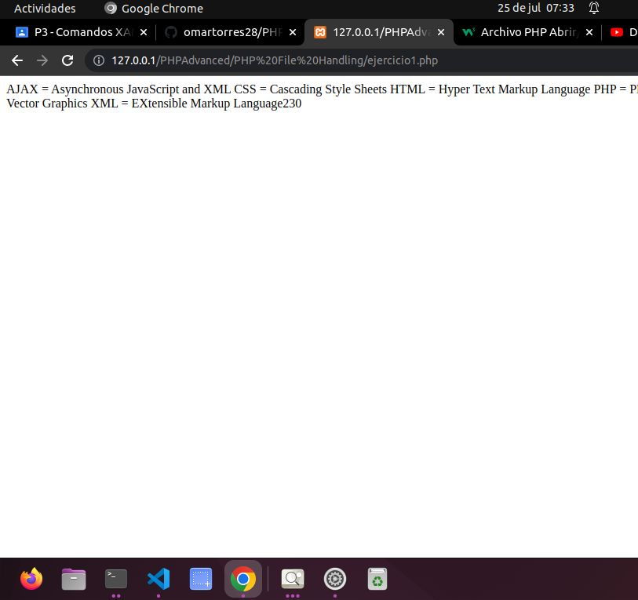

# PHP FILE OPEN READ 

## Ejercicio.1
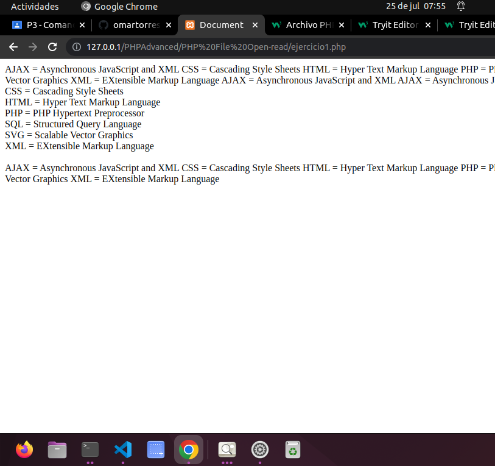

=======

## Ejercicios sessiones php

# Ejercicio 1: 

>>>>>>> 9148872b833c3d743dfc0d37060285ec4548cd24
