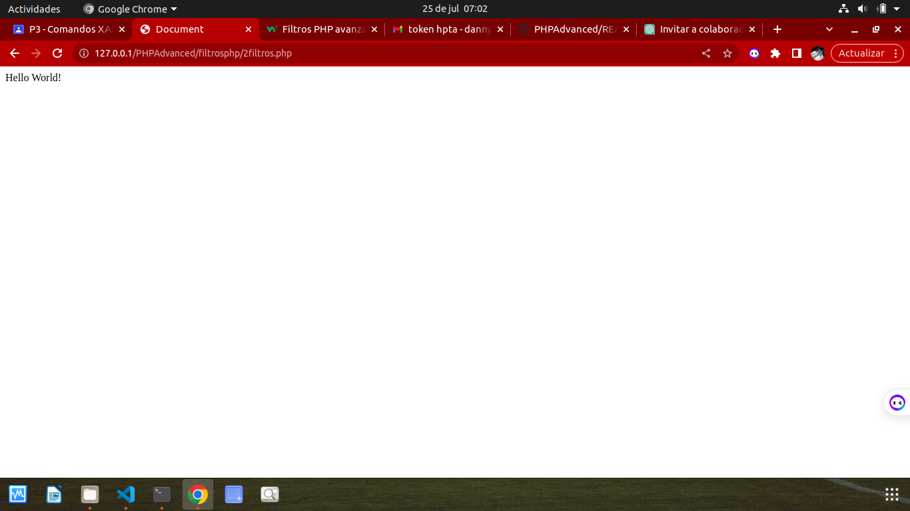
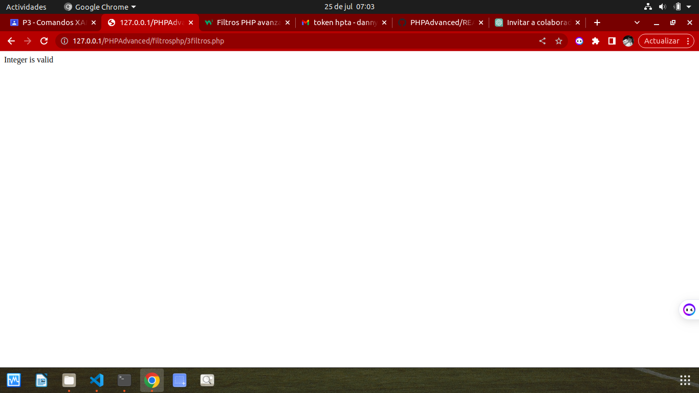
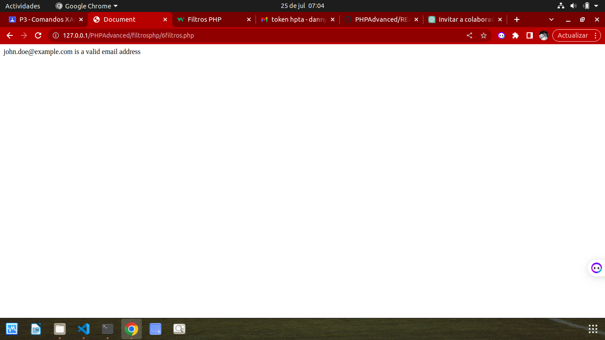
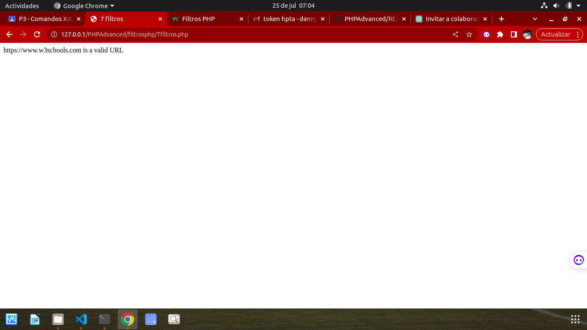
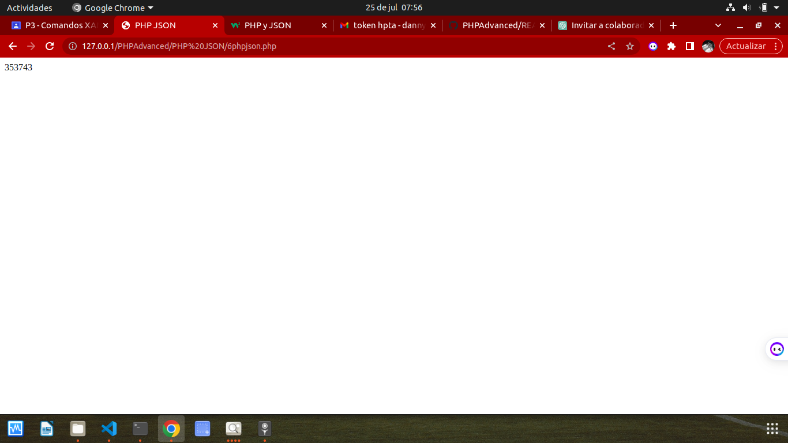
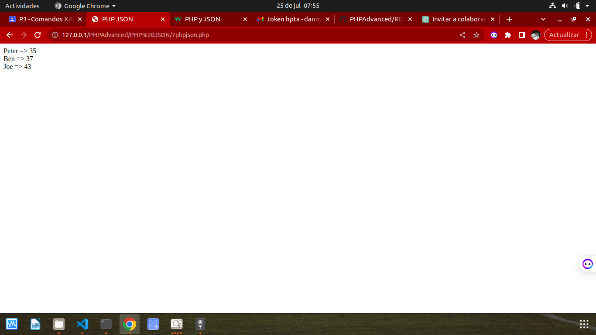

# PHPAdvanced

## PHP DATE AND TIME 

## Ejercicio.1

### El parámetro de formato requerido de la función date() especifica cómo formatear la fecha (o la hora).
### Aquí hay algunos caracteres que se usan comúnmente para las fechas:

## Ejercicio.2

## Ejercicio.3 

## Ejercicio.4 

## Ejercicio.5 

## Ejercicio.6 

## Ejercicio.7

## Ejercicio.8 

## Ejercicio.9 

# PHP INCLUDE 

## Ejercicio.1

## Ejercicio.2 

## Ejercicio.3 

## Ejercicio.4

## Ejercicio.5

# PHP FILE HANDLING

## Ejercicio.1

# PHP FILE OPEN READ 

## Ejercicio.1

=======

## Ejercicios sessiones php

# Ejercicio 1: Sessiones

# Ejercicio 2: Sessiones

# Ejercicio 3: Sessiones

# Ejercicio 4: Sessiones

---

## Ejercicios Filtros php

# Ejercicio 1: Filtros

# Ejercicio 2: Filtros

# Ejercicio 3: Filtros

# Ejercicio 4: Filtros

# Ejercicio 5: Filtros

# Ejercicio 6: Filtros

# Ejercicio 7: Filtros

---

## Ejercicios Filtros Avanzados en php

# Ejercicio 1: Filtros Avanzados

# Ejercicio 2: Filtros Avanzados

# Ejercicio 3: Filtros Avanzados

# Ejercicio 4: Filtros Avanzados

---

## Ejercicios Funciones de devolución de llamada

# Ejercicio 1: Funciones de devolución de llamada

# Ejercicio 2: Funciones de devolución de llamada

# Ejercicio 3: Funciones de devolución de llamada

---

## Ejercicios PHP JSON

# Ejercicio 1:PHP JSON

# Ejercicio 2:PHP JSON

# Ejercicio 3: PHP JSON

# Ejercicio 4:PHP JSON

# Ejercicio 5:PHP JSON

# Ejercicio 6: PHP JSON

# Ejercicio 7:PHP JSON

# Ejercicio 8: PHP JSON

<<<<<<< HEAD
=======

>>>>>>> 9148872b833c3d743dfc0d37060285ec4548cd24
>>>>>>> d56f9ae7471add539c271362bfac30b2f4773d0b
